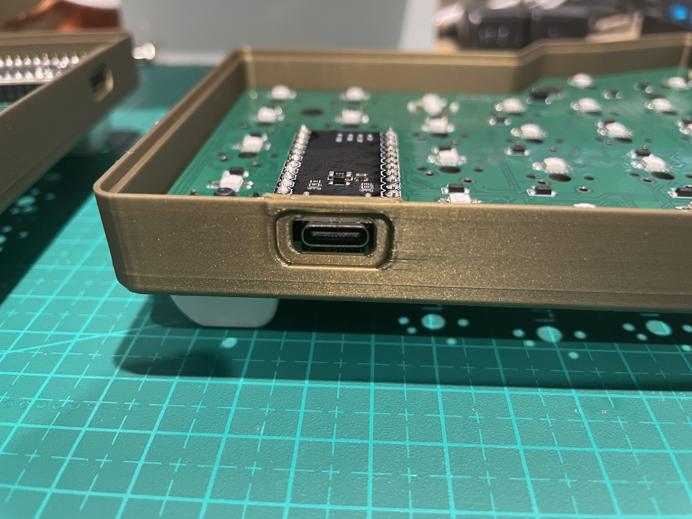
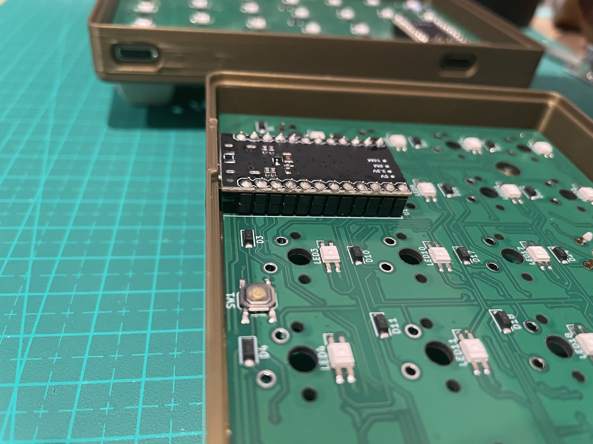

## Warning
Before soldering switches, make sure the USB opening placement on the case matches your mounted microcontroller position on the PCB.

| Example 1 | Example 2 |
| --- | --- |
|  |  |

## Printable Case Types
- **Fixed-height USB opening** (`*-usb-fixed-5mm.3mf`): for total microcontroller socket height of **4.5-5mm**, with controllers that have the USB port mounted on top of their PCB.
- **Movable USB opening** (`*-usb-movable.3mf`): includes the USB opening as a **negative part** (for Bambu Studio) that can be moved up/down in **Z** to fit your microcontroller and USB port position.

## Variants
Each case type is available in:
- **Wireless**: includes an opening for the power slide switch.
- **Wired**: power slide switch area is covered.

## Bottom, Hardware, and Fasteners
- The case bottom included in each 3MF file is designed for **9-10mm standoffs**.
- Use **M2x8 (4 pcs)** screws for the top and **M2x4 (4 pcs)** screws for the bottom.
- Use **4 standoffs per side** of the case.

## Heat-Insert Bottom Variant
A separate bottom variant is available: `bottom-for-heat-inserts.3mf`.
- Accepts **M2x4 heat inserts** instead of standoffs.
- Use inserts meant for **plastic insertion** (not inserts intended for injection-molded plastic).
- Inserts must be installed very accurately for proper fit.
- This variant can provide a better sound profile.

