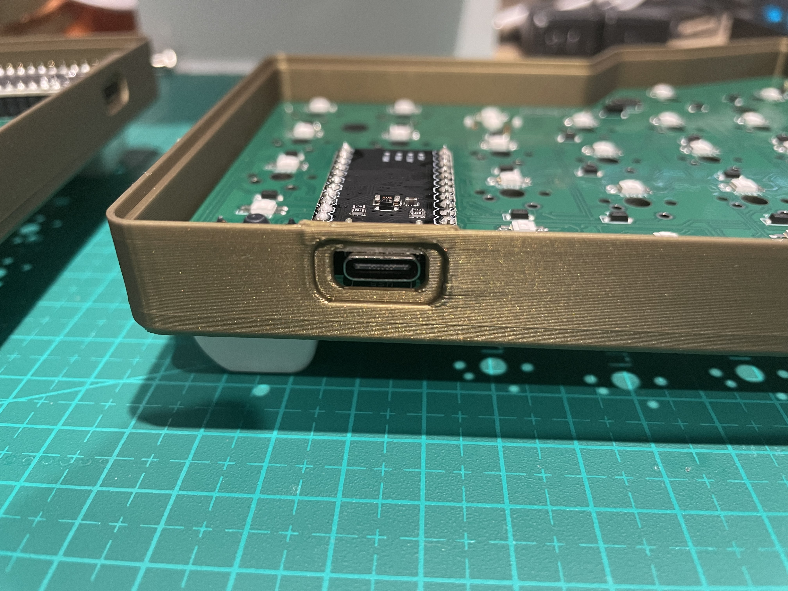
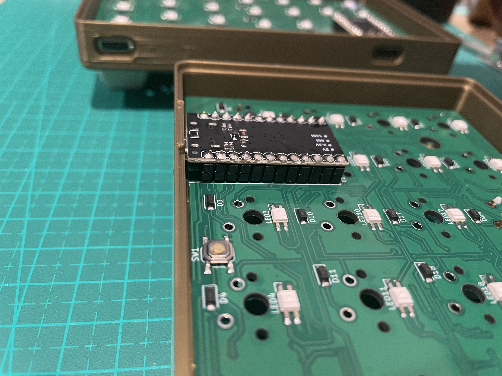

## Warning
Before soldering switches, confirm that the case USB opening lines up with your microcontroller's USB port position on the PCB.

| Example 1 | Example 2 |
| --- | --- |
|  |  |

## Printable Case Types
- **Fixed-height USB opening** (`*-usb-fixed-5mm.3mf`)
	- For total microcontroller socket height of **4.5-5 mm**.
	- Intended for controllers with the USB port mounted on top of the PCB.
- **Movable USB opening** (`*-usb-movable.3mf`)
	- Includes a USB opening as a **negative part** (for Bambu Studio).
	- You can move this part up or down on the **Z axis** to match your board and socket height.

## Which Case Should You Use?
- **`case-wired-usb-fixed-5mm.3mf`**
	- For wired builds with total socket height of **4.5-5 mm**.
	- For MCU boards with the USB connector on top of the PCB.
	- The power-switch opening is covered.

	
- **`case-nice-nano-and-rp2040-usb-movable.3mf`**
  - For wired or wireless builds with total socket height of **4.5-5 mm**.
  - For boards with a USB connector recessed into the board (for example, nice!nano or Tenstar RP2040 Pro Micro).
  - Includes a power-switch opening by default.
  - You can move the USB negative object in Z and optionally remove the power-switch opening for wired builds.
  - This is the most adjustable 3MF option.

  
- **`case-wired-usb-movable.3mf`**
	- For wired builds.
	- Includes a movable negative object for the USB opening.
	- Adjust USB opening height to fit your specific MCU and mounting height.
- **`case-for-pcb-mount-switches.3mf`**
	- Designed for PCB-mount switches and is less forgiving than other options.
	- The top plate is optional and removable; it does not hold switches permanently.
	- Switches sit directly on the PCB in this build.
	- If you use the top plate, install it before soldering and ensure:
		- switches are fully seated on the PCB,
		- the plate is fully touching the PCB.
	- Due to tight tolerances, soldering switches first may prevent the top case from fitting later.
	- Recommended approach: tape the plate to the PCB, solder switches in the corners first, then solder the rest.

## Bottom, Hardware, and Fasteners
- The bottom included in each 3MF is designed for **9-10 mm standoffs**.
- Use **M2x8 screws (4 pcs)** for the top.
- Use **M2x4 screws (4 pcs)** for the bottom.
- Use **4 standoffs per side**.

## Heat-Insert Bottom Variant
A separate bottom file is available: **`bottom-for-heat-inserts.3mf`**.
- Accepts **M2x4 heat inserts** instead of standoffs.
- Use inserts intended for plastic insertion (not inserts for injection-molded plastic).
- Install inserts accurately for proper fit.
- This variant can provide a better sound profile.

