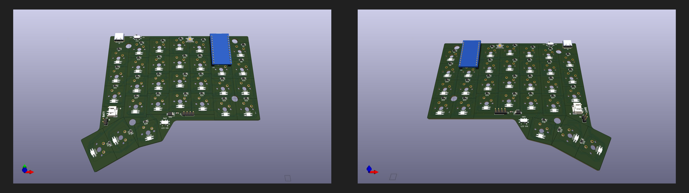

## Production Files

You can order this split keyboard from any major PCB manufacturer using the production-ready files in this directory.

- `left/` contains manufacturing files for the left PCB
- `right/` contains manufacturing files for the right PCB

## Example: Ordering from JLCPCB

1. Open JLCPCB and start a new PCB order.
2. Upload the left and right Gerber ZIPs separately (one order per side).
3. Confirm board specs (dimensions, thickness, copper weight, solder mask color, and finish).
4. Keep defaults unless you need specific changes.
5. Add both boards to cart, review, and place the order.
