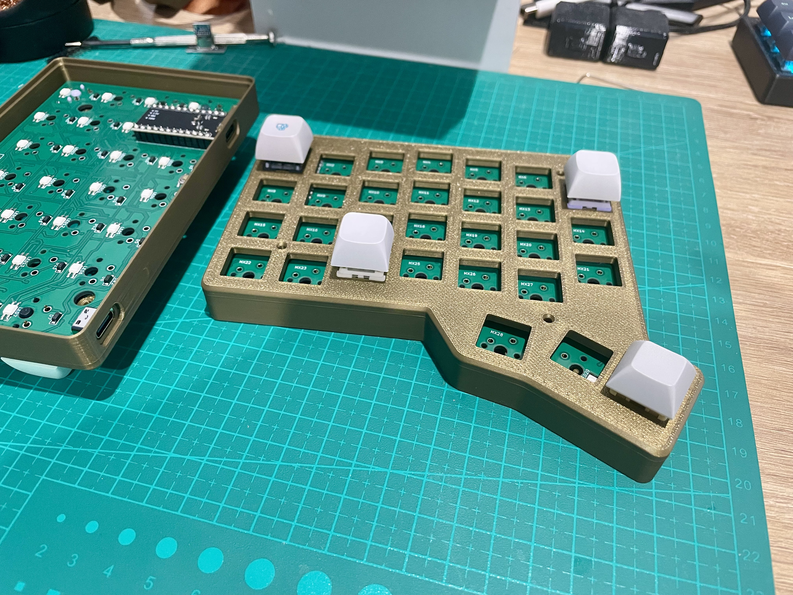
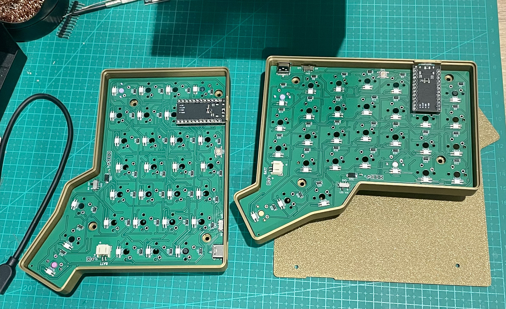

# Wings60

Wings60 is an open source split keyboard designed after trying many existing split layouts and refining what works best in daily use.

## Why this layout

This keyboard is an improvement on most common split layouts by:

- Improving key access for the thumb cluster by removing thumb-twister keys and adding one 1.5u key with good access where many layouts miss.
- Using a natural thumb cluster orientation selected after testing many existing layouts.
- Using the most popular column stagger.
- Keeping the same PCB usable for wired or wireless builds, including a power slide switch, JST PH2.0 battery plug, and between-halves interconnects on the PCB.
- Using USB-C for wired interconnect between halves, which is superior to 1/4 stereo connections because it can be hot-plugged without damaging microcontrollers.
- Supporting pro-micro pinout controllers such as Nice!Nano, Pro Micro ATmega32u4, and Pro Micro RP2040.
- Using low-power RGB LEDs (SK6803 mini-e), which draw less power than common WS2812B and SK6812 variants.
- Including a slide switch to cut LED power for zero LED idle current in power-conscious assemblies.
- Staying compact while keeping a top number row.

## How to assemble

### Bill of materials

- Sockets for MCU: one of EZ-Solder Machine Sockets or a 40-pin machined IC breakable female header strip with Mill-Max pins is recommended for a total socket height of 4.5-5mm. This works best with the 3D printable case designs in [case](./case). Check USB connector height after assembly against the case USB opening. If your USB sits higher/lower, use the adjustable USB case variant described in [case/readme.md](./case/readme.md). A good guide to socketing microcontrollers is available here: [Machine pin socket guide](https://github.com/joric/nrfmicro/wiki/Sockets#machine-pin-socket)
- Two pro micros: use any board with firmware already available in [firmware](./firmware), or any pro-micro-pinout compatible board and adjust firmware as needed. For wireless, use Nice!Nano or compatible SuperMini nRF52840.
- Either 4x 9-10mm standoffs with 4x M2x8 and 4x M2x4 screws for each half, or 4x M2x4 heat inserts with the heat-insert-compatible case bottom. See [case/readme.md](./case/readme.md).
- Non-slip rubber feet, 4x per half. 6mm diameter x 2mm height works well.
- [Wired only] A USB-C to USB-C cable for connecting the right and left halves.
- [Wireless only] A JST PH2.0 battery up to 5mm height. Check dimensions against the case if using the designs in [case](./case).
- Switches and keycaps.

### Wired build

1. Solder and socket the microcontrollers to PCBs, **face down**. USB side must face the PCB. A good socketing guide: [Splitkb microcontroller guide](https://docs.splitkb.com/product-guides/aurora-series/build-guide/microcontrollers)
2. Check USB height to make sure it fits the case designs in [case](./case). If it fits fixed-USB, use that variant; otherwise adjust USB height in the movable/adjustable variant in your slicer.
3. Fit switches to the case, minding pin orientation.
4. Fit the PCB to the case with flat side toward switches and components facing away from switches, so switch pins come out through the PCB. PCB should rest on the bottom of the switches. You may need gentle pressure for switch mounting pins to pop in.

5. Check no switch has popped out, and all switches are firmly seated on top of the case top side. Then solder all switch legs to the PCB.
6. Flash firmware using instructions here [firmware/readme.md](./firmware/readme.md)
7. If using standoff bottoms, screw each standoff to the case with M2x8 screws. V-shaped heads sit flush in the top-side recesses.
8. Screw case bottoms to standoffs using M2x4 screws, then apply non-slip feet.
9. If using heat-insert bottoms, install heat inserts and fit the bottom to the top using M4x8 screws.
 

The halves can now be connected using the USB-C cable. Connect one microcontroller to your PC (either half, but not both).

Use [Vial](https://get.vial.today/) to configure the keyboard. Configuration is saved to the half connected to the PC.

### Wireless build

TBD

